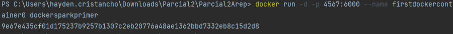

# Parcial 2 AREP
## Hayden Esteban Cristancho

### 1. Implementación de DockerS
* Creamos la imagen de docker 

* Verificamos que se haya creado correctamente

* Creamos una instacia

* Ejecutamos el dockercompose

* Verificamos que esta corriendo en docker 

* Creamos una referencia a la imagen, junto con el nombre del respositorio creado en dockerhub

* Hacemos push al repositorio

### 2. Implementacion en aws

* Accedemos a la instancia

* Realizamos la instalacion de docker

* Hacemos el dockerun de la imagen

* Creamos la regla de entrada

* Verificamos que funcione

